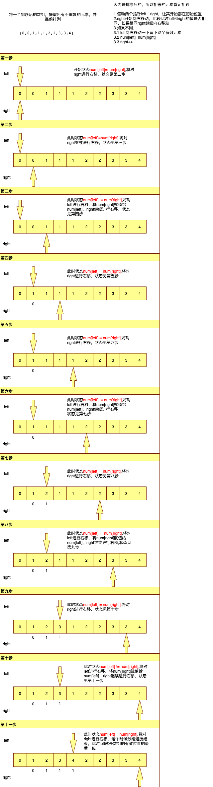

# 3. 无重复字符串最长子串

[原题链接](https://leetcode-cn.com/problems/longest-substring-without-repeating-characters/)

### **题目描述**

给定一个字符串 `s` ，请你找出其中不含有重复字符的 **最长子串** 的长度。

**示例 1:**

```
输入: s = "abcabcbb"
输出: 3 
解释: 因为无重复字符的最长子串是 "abc"，所以其长度为 3。
```

**示例 2:**

```
输入: s = "bbbbb"
输出: 1
解释: 因为无重复字符的最长子串是 "b"，所以其长度为 1。
```

**示例 3:**

```.txt
输入: s = "pwwkew"
输出: 3
解释: 因为无重复字符的最长子串是 "wke"，所以其长度为 3。
     请注意，你的答案必须是 子串 的长度，"pwke" 是一个子序列，不是子串。
```

**示例 4:**

```
输入: s = ""
输出: 0
```

**提示：**

- `0 <= s.length <= 5 * 104`
- `s` 由英文字母、数字、符号和空格组成

****

### 思路分析

提示的第二个信息是说s是由ascii字符组成的字符串，参考如下：

英文字母a-z对应ascii的十进制数是97-122

英文字母A-Z对应ascii的十进制数是65-90

数字0-9对应的ascii的十进制数是48-57

ascii共收录了128个字符，使用一个字节就可以存储。

- 所以可以使用一个大小为128的数组dict，其中数组的下标代表每个字符，数组的值代表该字符出现的次数。这个套路经常用。
- 定义两个指针left，right初始都指向s的起始位置
- 定一个length为0代表最大长度
- 遍历字符串s的每个字符c，使dict[c]++；c虽然是字符类型，由于字符和int的渊源（它们之间的桥梁就是ASCII码），这个也是常用套路
- 如果此时dict[c]的值大于1说明此时left和right之间的子串的字符有重复的，需要去重直到left和right之间没有重复的字符
  - 从left开始对dict[s.charAt(left)]进行减1操作，直到dict[c]的值小于等于1
- 如果不大于1则right++，判断此时left和right之间的长度和length的值的大小，是否需要更新length

# 26. 删除数组中的重复项

[原题链接](https://leetcode-cn.com/problems/remove-duplicates-from-sorted-array/)

### 题目描述

给你一个有序数组 nums ，请你 原地 删除重复出现的元素，使每个元素 只出现一次 ，返回删除后数组的新长度。

不要使用额外的数组空间，你必须在 原地 修改输入数组 并在使用 O(1) 额外空间的条件下完成。

**示例 1：**

```.text
输入：nums = [1,1,2]
输出：2, nums = [1,2]
解释：函数应该返回新的长度 2 ，并且原数组 nums 的前两个元素被修改为 1, 2 。不需要考虑数组中超出新长度后面的元素。
```

**示例 2：**

```.text
输入：nums = [0,0,1,1,1,2,2,3,3,4]
输出：5, nums = [0,1,2,3,4]
解释：函数应该返回新的长度 5 ， 并且原数组 nums 的前五个元素被修改为 0, 1, 2, 3, 4 。不需要考虑数组中超出新长度后面的元素。
```

### 思路分析

这个题目的意思就是对一个排序后的数组，提取所有不重复的元素，并使其排列靠前。

有个关键性因素，**排序后的，说明相等的元素肯定相邻**。

- 定义两个指针left、right，开始指向数组的起始位置，开始遍历数组num
- 如果num[left] = num[right] 让right++
- 如果num[left] != num[right] 
  - 先让left++ ，留下当前的一个有效元素
  - 将此时right的指向的值 赋值给 left指向的位置
  - 让right++ ，进行下一轮的遍历
- 直到数组遍历结束，这个时候left指向数组有效元素的最后一个位置



