# 第一章

# 第二章

## 2.1.1

## 2.2

## 2.3 线性结构和非线形结构

数据结构包括：线性结构和非线性结构

### 2.3.1 线性结构

1. 线性结构作为最常用的数据结构，其特点是**数据元素之间存在一对一**的线性关系

2. 线性结构有两种不同的存储结构，即**顺序存储结构**和**链式存储结构**。顺序存储的线性表称为顺序表，顺序表中的存储元素是连续的（存储地址）
3. 链式存储的线性表称为链表，链表中的存储元素不一定是连续的，元素节点中存放数据元素以及相邻元素的地址信息

4. 常见的线性结构有：数组、队列、链表和栈

### 2.3.2 非线性结构

1. 非线性结构包括：二维数组、多维数组、广义表、树结构、图结构

# 第三章 稀疏数组和队列

## 3.1 稀疏 sparsearray 数组

### 3.1.1 实际的需求

**编写的五子棋程序中，有存盘退出和续上盘的功能**

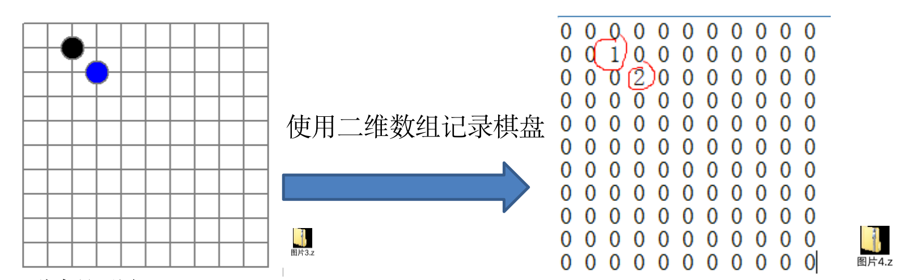

**分析问题**

因为左侧二维数组中存放了很多的默认值0，因此**记录了很多没有意义的数据**-->稀疏数组

### 3.1.2 基本介绍

当一个数组中大部分元素为0，或者为同一个值时，可以使用稀疏数组来保存该数组。

稀疏数组的处理方法

1. 记录数组一共有几行几列，有多少个值
2. 把具有不同值的元素的行列及值信息记录在一个小规模的数组中，从而缩小程序的规模

**稀疏数组举例说明**

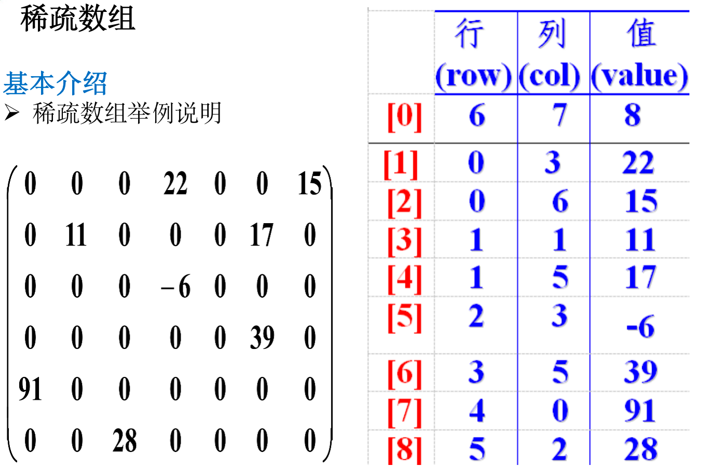

### 3.1.3 应用实例

**二维数组转稀疏数组**

1. 遍历原始的二维数组，得到有效数据的个数sum
2. 根据sum就可以创建稀疏数组sparseArr int\[sum+1][3]
3. 将二维数组的有效数据存入到稀疏数组

**稀疏数组转二维数组**

1. 先读取稀疏数组的第一行，根据第一行的数据，创建原始的二维数组
2. 在读取稀疏数据后几行的数据，并赋值给二维数组即可

## 3.2 队列

### 3.2.1 队列的使用场景

银行排队的案例

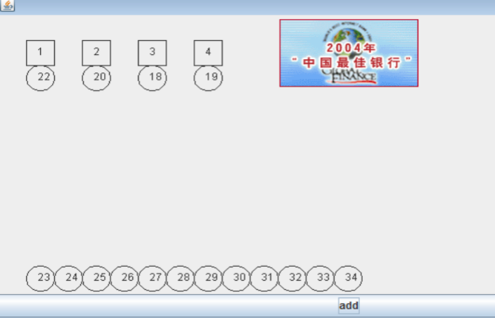

### 3.2.2 队列介绍

1. 队列是一个有序列表，可以使用**数组**或者是**链表**来实现

2. 队列遵循先进先出的原则。即：先存入队列的数据，要先取出；后存入队列的数据后取出。

3. 使用数组模拟队列的示意图

   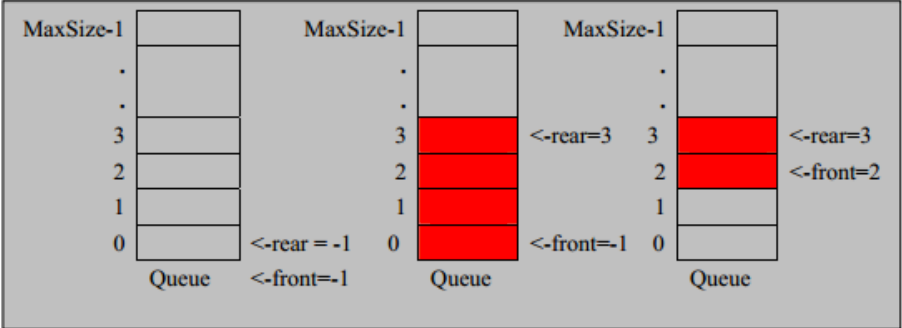

### 3.2.3 数组实现队列思路

- 队列本身是有序列表。若使用数组来实现队列存储数据，则队列数组声明如上图所示，其中MaxSize是该队列的最大容量
- 因为队列的输入、输出是分别从起始和末尾来处理，因此需要两个变量front和rear分别记录队列的起始位置和末尾位置。front会随着数据的输出而改变，rear会随着数据的输入而改变。front和rear初始设置为-1。
- 当有数据入队列时，需要考虑如下
  - 当前队列是否已满。rear==MaxSize-1，如果满了则无法存数据
  - rear末尾下标指示后移rear++，将数据存入rear所指的数组中
- 当有数据出队列时，需要考虑如下
  - 当前队列是否空。front==rear，如果队列为空则无数据可出
  - front起始位置后移front++，返回当前front位置的数据

 **问题分析**

1. 使用数组模拟队列，当队列状态满了之后，数组就不能再继续使用了。
2. 可以改成一个**环状的队列**，取模%

### 3.2.4 数组模拟环形队列

对数组模拟队列的优化，充分利用数组，因此将数组看作是一个环形的（通过**取模的方式**来实现）。

**分析说明**

1. front指向当前队列头元素，初始位置为0
2. rear指向队列尾元素的下一个位置，初始位置为0
3. 当(rear+1)%maxSize=front时 表示队列满了
4. 当rear=front时表示队列为空
5. 当队列增加元素时rear=(rear+1)%maxSize
6. 当元素从队列里取出时front=(front+1)%maxSize

# 第四章 链表

## 4.1 链表介绍

链表是有顺序的列表，它在内存中存储如下：

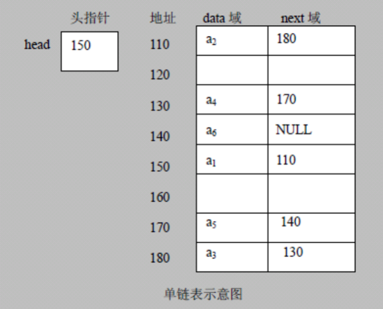

1. 链表是以节点的方式来存储，是链式存储。
2. 每个节点包含一个data域，一个next域
3. 链表的各个节点不一定是连续存储的
4. 链表分带头节点和不带头节点的的链表，根据实际的需求来确定

## 4.2 单链表的应用实例

> 使用带头节点的单向链表实现英雄排行榜管理。完成对英雄人物的增删改查操作

**直接添加到链表尾部逻辑分析**

- 链表头节点用来做为牵引头，不移动

- 当节点的next属性为空时表示链表最后

- 添加节点时，从头节点获取第一个有效数据，开始遍历链表找到最后一个节点，将待添加的节点添加到最后

**按顺序添加节点分析**

- 从头节点开始获取有效节点（next）开始进行遍历链表

- 判断是否到达链表的最后，如果是则可以直接添加，否则进行下一步
- 判断当前节点的下一个节点的值是否大于要添加的节点的值，是跳出循环进行下一步，否继续遍历
- 判断当前节点的下一个节点的值是否等于要添加的节点的值，是跳出循环进行下一步，同时标识有相同节点，否继续遍历
- 判断是否是相同的节点，如果是相同的节点，输出提示不进行添加，如果不是相同节点进行下一步
- 将待添加节点的next指向当前节点的next，再将当前节点的next指向待添加节点

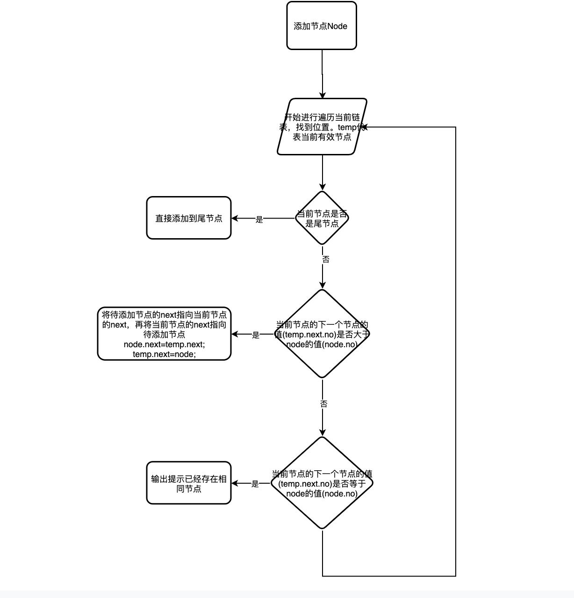

**删除节点逻辑分析**

- 如果到最后节点了，说明不存在要删除的节点

- 找到需要删除节点的前一个节点temp
- 将temp.next=temp.next.next

**更新节点逻辑分析**

- 如果是空节点，则更新操作不能完成，否则进行下一步
- 判断是否是要更新的节点，是则更新，否继续循环查找

## 4.3 单链表面试题

**求单链表有效节点的个数**

- 遍历链表，进行加一，直到最后一个节点

**查找单链表中倒数第k个节点**

- 判断k是否有效，即k不能小于等于0，也不能大于有效节点个数
- 倒数第k个就是正数第（length-k）个
- for循环遍历到第（length-k）个节点，就是要查找的倒数第k个节点

**单链表反转**

- 创建一个新的头节点revertHead，
- 对要反转的链表进行遍历，遍历时将当前遍历的节点取出，放到新的链表的最前面
- 将原来链表的头节点的next指向revertHead的next

**合并两个有序链表**

- 其实就是对链表的节点进行有序添加

## 4.4 双向链表应用实例

### 4.4.1 双向链表的操作分析和实现

- next指向当前节点的下一个节点
- pre指向当前节点的前一个节点

**单向链表的缺点分析**

- 单项链表的查找方向只能是一个方向，而双向链表可以向前或者向后查找
- 单项链表不能自我删除，需要靠辅助节点，而双向链表可以自我删除

**双向链表的遍历**

遍历的方式和单链表一样，区别是双向链表可以向前查找，也可以向后查找

**添加节点到双向链表的最后**

- 先找到尾节点temp
- 让temp.next=newNode，同时让newNode.pre=temp

**双向链表的修改**

修改和单向链表一样

**双向链表的删除**

- 找到要删除的节点temp
- 执行temp.pre.next=temp.next，同时让temp.next.pre=temp.pre

## 4.5 单向环形链表

如下图所示是一个节点和多个节点时单向环形链表的状态。

当只有一个节点时，该节点的next域指向自己。

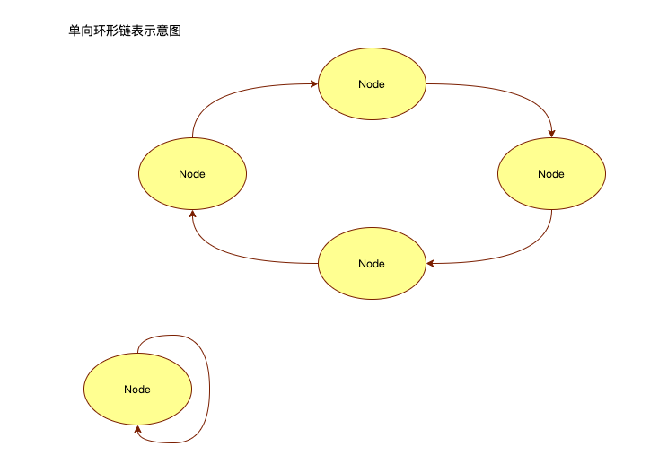

## 4.6 单向环形链表应用场景

Josephu（约瑟夫）问题

Josephu问题为:设编号为 1，2，... n 的 n 个人围坐一圈，约定编号为 k(1<=k<=n)的人从 1 开始报数，数 到 m 的那个人出圈，它的下一位又从 1 开始报数，数到 m 的那个人又出圈，依次类推，直到所有人出列为止，由 此产生一个出圈编号的序列。

提示:用一个不带头结点的循环链表来处理 Josephu 问题:先构成一个有 n 个结点的单循环链表，然后由 k 结 点起从 1 开始计数，计到 m 时，对应结点从链表中删除，然后再从被删除结点的下一个结点又从 1 开始计数，直 到最后一个结点从链表中删除算法结束。

## 4.7 Josephu问题

需要一个first变量，用来代表环的起始。

### 4.7.1 初始化环

- 环的大小应该不小于1，否则无意义
- 一个指向当前末尾的节点变量currentNode，保证currentNode.next=first
- 添加的节点temp

**添加节点的操作步骤**

1. 创建一个节点temp

2. 判断节点编号是不是1即第一个节点，如果是就让first变量指向它，同时让currentNode也指向它，然后设置currentNode.next=first；

3. 如果不是一号节点，让currentNode.next=temp；然后让currentNode指向temp，然后设置currentNode.next=first；

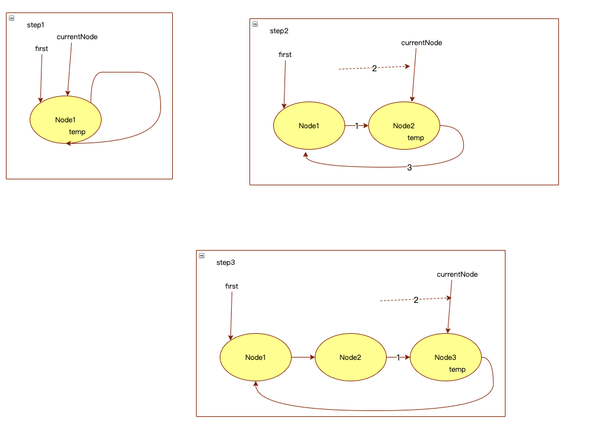

### 4.7.2 出圈

**出圈的操作步骤**

1. 创建一个辅助节点helperNode，该节点初始指向队列的末尾节点。

2. 根据startNo，同步的移动helperNode和first，此时helperNode的next指向first

3. 然后再找到要出圈的节点delNode，根据计数的次数countNo。循环得到delNode的位置
4. 让firstNode指向delNode.next，让helperNode.next指向first节点helperNode.next=first

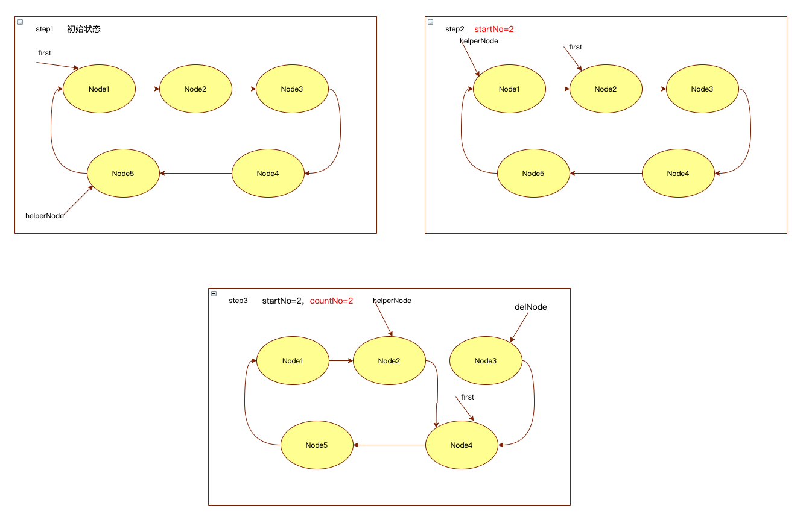

# 第五章 栈

## 5.1 栈的一个实际需求

计算表达式的值

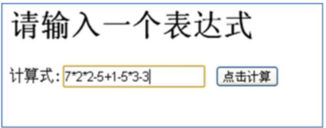

计算机底层是如何运算得到结果的? 我们看这个算式 7 * 2 * 2 - 5, 但是计算机怎么理解这个算式的(对计算机而言，它接收到的就是一个字符串)

## 5.2 栈的介绍

1. 栈也称为stack
2. 栈是一个先入后出的有序列表
3. 栈是限制线性表中元素的插入和删除只能在线性表的同一端进行的一种特殊线性表。允许插入和删除的一端称为**栈顶**，另一端为固定的一端称为**栈底**。
4. 根据栈的定义可知，最先放入栈中的元素在栈底，最后放入的元素在栈顶；而删除元素则刚好相反，最后放入的元素最先被删除，最先放入的元素最后被删除
5. 如下图所示

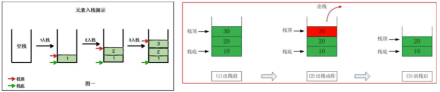

## 5.3 栈的应用场景

1. 子程序的调用：在跳往子程序前，会先将当前程序的下个指令的地址存到栈中，直到子程序执行完后在将地址取出，以回到原来的程序中
2. 处理递归调用：和子程序的调用类似，只是除了存储下一个指令的地址外，也将参数、区域变量等数据存入了栈中
3. 表达式的转换（中缀表达式转后缀表达式）与求值
4. 二叉树的遍历
5. 图的深度优先搜索法

## 5.4 栈的快速入门

1. 用数组模拟栈的使用，由于栈是一种有序列表，所以可以使用数组的结构来存储栈的数据结构
2. 实现思路如下：
   1. 定义top表示栈顶，初始值为-1
   2. 入栈操作，top++;stack[top]=value
   3. 出栈操作，int value=stack[top]; top--;

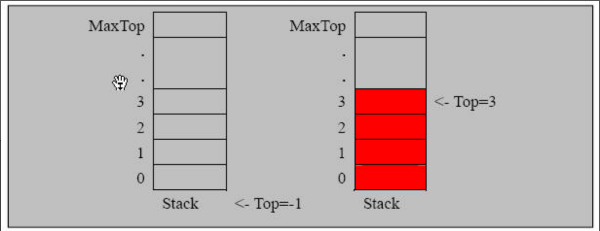

​	

## 5.5 栈实现综合计算器（中缀表达式）

使用栈来实现综合计算器（此时只有正整数的加减乘除运算）。

输入一个表达式[7\*2\*2-5+1-5+3]计算结果。

思路分析：

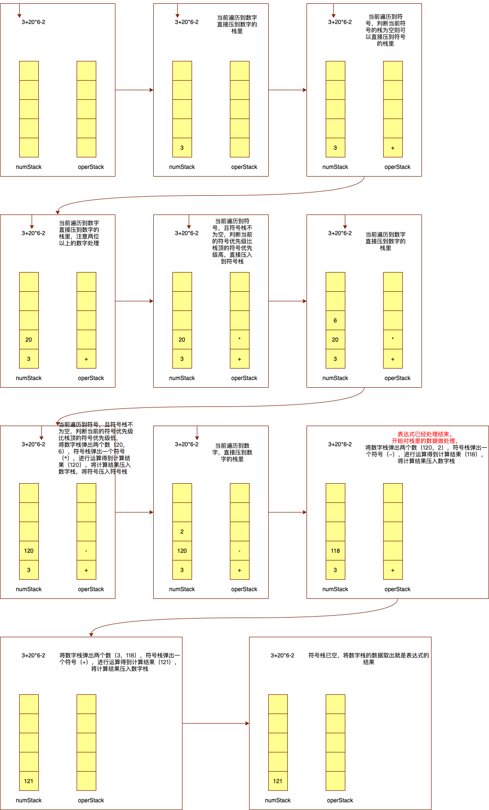

## 5.6 逆波兰计算器

### 5.6.1 前缀表达式

前缀表达式又称波兰表达式。前缀表达式的运算符位于操作数之前。

举例： (3+4)×5-6 对应的前缀表达式就是 - × + 3 4 5 6

**前缀表达式的计算过程**

从右至左扫描表达式，遇到数字时，将数字压入栈中，遇到运算符时，弹出栈顶的两个数，用运算符对它们做响应的计算，并将结果入栈；重复这个过程直到表达式最左端，最后运算得出的值就是表达式的计算结果。

举例：(3+4)×5-6 对应的前缀表达式就是 - × + 3 4 5 6 , 针对前缀表达式求值步骤如下:

1. 从右至左扫描，将6、5、4、3压入栈中
2. 遇到+运算符，因此弹出3和4，计算出3+4的值，得到7，再将7入栈
3. 接下来是x运算符，因此弹出7和5，计算出7x5=35，将35入栈
4. 最后是 - 运算符，计算出35-6的值，即29，由此得出最终结果

### 5.6.2 中缀表达式

中缀表达式就是常见的运算表达式，如(3+4)×5-6。

中缀表达式的求值是我们人最熟悉的，但是对计算机来说却不好操作，因此，在计算结果时，往往会将中缀表达式转成其它表达式来操作(一般转成后缀表达式.)

### 5.6.3 后缀表达式

后缀表达式又称逆波兰表达式,与前缀表达式相似，只是运算符位于操作数之后

举例： (3+4)×5-6 对应的后缀表达式就是 3 4 + 5 × 6 –

| 正常表达式 | 逆波兰表达式  |
| ---------- | ------------- |
| a+b        | a b +         |
| a+(b-c)    | a b c - +     |
| a+(b-c)*d  | a b c – d * + |
| a+d*(b-c)  | a d b c - * + |
| a=1+3      | a 1 3 + =     |

**后缀表达式计算过程**

从左至右扫描表达式，遇到数字时，将数字压入栈中，遇到运算符时，弹出栈顶的两个数，用运算符对它们做相应的计算，并将结果入栈；重复这个过程直到表达式最右端，最后运算得出的值就是表达式的计算结果。

举例：(3+4)×5-6 对应的后缀表达式就是 3 4 + 5 × 6 - , 针对后缀表达式求值步骤如下:

1. 从左至右扫描，将3和4压入栈中
2. 遇到运算符+，因此弹出3和4，计算出3+4的值，得到7，再将7入栈
3. 将5入栈
4. 接下来是 x 运算符，因此弹出5和7，计算7x5的值，得到35，将35入栈
5. 将6入栈
6. 接下来是 - 运算符，因此弹出35和6的值，计算35-6的值，得到29，由此得到最终结果。

### 5.6.4 逆波兰计算器

逆波兰表达式就是计算后缀表达式的值，这里使用jdk提供的Stack栈数据结构

## 5.7 中缀表达式转化为后缀表达式

在逆波兰表达式实现计算器中可以发现后缀表达式实现起来比较方便，但是得到后缀表达式的结果手动实现比较难，尤其表达式很长的情况下。下面看下将中缀表达式转为后缀表达式的步骤。

### 5.7.1 实现步骤

注意：*下面步骤中说的运算符是指加减乘除等运算符，左右括号()使用操作符表示，同时操作符没有优先级，只有运算符有优先级*

1. 初始化两个栈，运算符栈s1和中间结果存储的栈s2
2. 从左至右扫描中缀表达式
3. 遇到操作数时，将其压入到栈s2中
4. 遇到运算符时，将其与s1栈顶符号的优先级比较
   1. 如果s1栈顶为空，或者栈顶运算符为左括号"("，则直接将此运算符入栈到s1
   2. 否则，若优先级比栈顶运算符高，也将此运算符入栈s1
   3. 否则，将s1栈顶的符号弹出并压入到s2中，再次转到4.1
5. 遇到括号时
   1. 如果是左括号，则直接压入到s1栈中
   2. 如果是右括号，则依次弹出s1栈顶的符号，并压入到s2栈中，直到遇到左括号为止，此时将这一对括号丢弃
6. 重复步骤2-5，直到表达式扫描结束
7. 将s1中剩余的运算符依次弹出并压入s2
8. 依次弹出 s2 中的元素并输出，结果的逆序即为中缀表达式对应的后缀表达式

### 5.7.2 举例说明

将中缀表达式“1+((2+3)*4)-5”转换为后缀表达式的过程如下：

| 扫描到的元素   | s2（栈底->栈顶）  | s1（栈底->栈顶） | 说明                                                         |
| -------------- | ----------------- | ---------------- | ------------------------------------------------------------ |
| 1              | 1                 |                  | 数字，直接入栈                                               |
| +              | 1                 | +                | 运算符，s1栈顶为空                                           |
| (              | 1                 | + (              | 是左括号，直接入栈                                           |
| (              | 1                 | + ( (            | 是左括号，直接入栈                                           |
| 2              | 1 2               | + ( (            | 数字，直接入栈                                               |
| +              | 1 2               | + ( ( +          | 运算符，此时s1栈顶是左括号，直接入栈                         |
| 3              | 1 2 3             | + ( ( +          | 数字，直接入栈                                               |
| )              | 1 2 3 +           | + (              | 右括号，循环弹出s1： 弹出+号压入到s2，直到遇到(，丢弃这一对括号 |
| *              | 1 2 3 +           | + ( *            | 运算符，此时s1栈顶是左括号，直接入栈                         |
| 4              | 1 2 3 + 4         | + ( *            | 数字，直接入栈                                               |
| )              | 1 2 3 + 4 *       | +                | 右括号，循环弹出s1： 弹出*号压入到s2，直到遇到(，丢弃这一对括号 |
| -              | 1 2 3 + 4 * +     | -                | 减号，此时s1栈顶是+ ，减号的优先级不比加号高，将s1栈顶的符号弹出并压入到s2中，继续和s1栈顶比较，这个时候s1空了，那么减号直接入栈 |
| 5              | 1 2 3 + 4 * + 5   | -                | 数字，直接入栈                                               |
| 表达式扫描结束 | 1 2 3 + 4 * + 5 - |                  | 将s1中的弹出到s2                                             |

最后的结果：1 2 3 + 4 * + 5 -

### 5.7.3 代码实现

注意：由于s2在实际操作中就是不断的添加元素，为了方便得到最后结果，在代码实现时可以使用List来代替

# 第六章 递归

## 6.1 递归应用场景

递归：recursion

## 6.2 递归的概念

简单说：递归就是方法本身调用自己。递归有助于编程者解决负责复杂的问题，同时可以让代码变得简洁。

## 6.3 递归的调用机制

方法区栈

## 6.4 递归解决的问题

1. 一些数学问题：8皇后、汉诺塔、阶乘、迷宫问题、球和篮子问题（Google编程大赛）
2. 一些算法中也会用到递归：快排、二分查找、归并排序、分治算法
3. 将用栈解决的问题使用递归解决代码比较简洁

## 6.5 递归需要遵守的规则

1. 在执行递归方法时，会将新的方法压入到方法区栈中
2. 方法中的局部变量是独立的，不会相互影响
3. 如果方法中使用的是引用类型变量，就会共享该引用类型的数据
4. 递归必须向退出递归的条件逼近，否则进入无限循环就会出现StackOverflowError。

## 6.6 递归-迷宫问题

## 6.7 递归-八皇后问题(回溯算法)

### 6.7.1 八皇后问题介绍

八皇后问题，是一个古老而著名的问题，是回溯算法的经典案例。该问题是国际西洋棋棋手马克斯·贝瑟尔于1848年提出：在8X8格的国际象棋上摆放八个皇后，使其不能互相攻击，即：**任意两个皇后都不能处于同一行、 同一列或同一斜线上，问有多少种摆法(92)**

### 6.7.2 八皇后问题算法思路分析

1. 第一个皇后先放第一行第一列
2. 第二个皇后放在第二行第一列，判断是否冲突，如果冲突就放在第三列依次把所有列放完，直到找到一个合适的
3. 第三个皇后放在第三行，还是第一列、第二列...直到第八个皇后也能放在一个不冲突的位置，算是找到了一个正确的解
4. 当得到一个正确的解时，在栈回退到上一个栈时，就会开始回溯。即将第一个皇后放在第一列的所有正确解找到
5. 然后将第一个皇后放在第一行第二列，后面继续循环执行1、2、3、4步骤，直到第一个皇后放到第一行第八列走完，得到所有的结果。

**说明**

一个8X8的棋盘，理论上应该创建一个二维数组来表示棋盘，但是实际上可以通过算法用一个一维数组解决问题。比如：arr[8] ={0 , 4, 7, 5, 2, 6, 1, 3}表示的含义是arr的下标表示第几个皇后即行，arr[index]的值表示列。

**两个点在同一个斜线**

点(x1,y1)和点(x2,y2)如果abs(x1-x2)=abs(y1-y2)那么两个点在一个斜线上

# 第七章 排序算法

## 7.1 排序算法的介绍

排序也称排序算法，排序是将**一组数据**，依**指定的顺序**进行**排列的过程**。

## 7.2 排序的分类

1. 内部排序：指将需要处理的数据都加载到**内存**中进行排序。
2. 外部排序：当**数据量过大**，无法全部加载到内存中，需要借助**外部存储**进行排序。

**常见的算法分类**

## 7.3 算法的时间复杂度

### 7.3.1 度量一个程序执行时间的两种方法

1. 事后统计法

   这种方法存在两个问题：一是想要对设计的算法的运行性能进行评价，需要实际运行该程序；二是所得到的时间依赖于计算机的硬件、软件等环境因素，这种方式，要在同一台计算机的相同状态下进行，才能比较哪个算法速度更快

2. 事前估计的方法

   通过分析某个算法的**时间复杂度**来判断哪个算法更优。

### 7.3.2 时间频度

**基本介绍**

一个算法花费的时间与算法中语句的执行次数成正比，哪个算法中语句执行次数多，它花费时间就多。**一个算法中的语句执行次数称为语句频度或时间频度**。

**举例说明**

- 忽略常数项

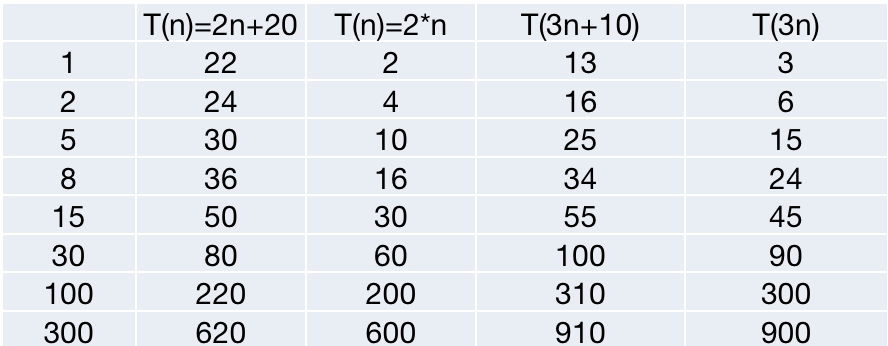

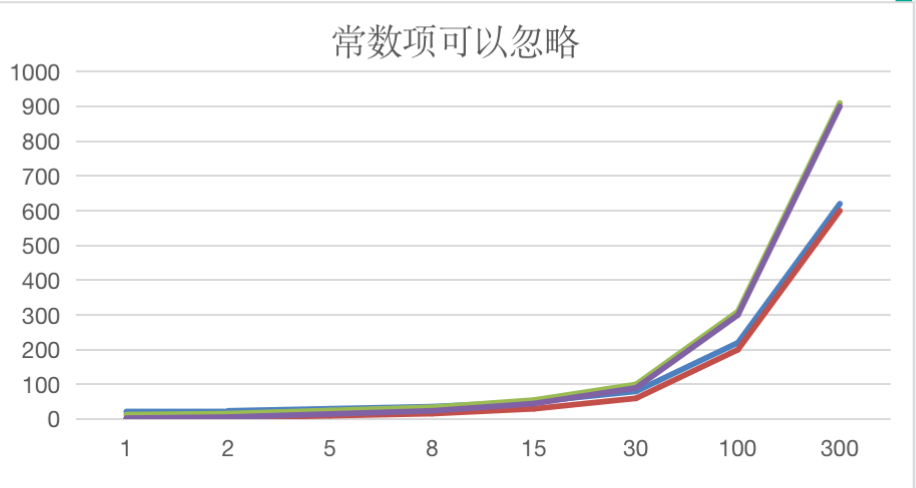

​	结论: 
​	2n+20 和 2n 随着n 变大，执行曲线无限接近, 20可以忽略
​	3n+10 和 3n 随着n 变大，执行曲线无限接近, 10可以忽略

- 忽略低次项

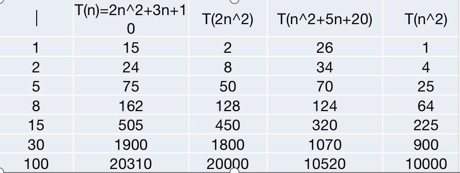

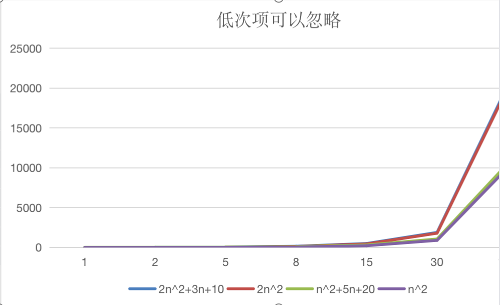

​	结论: 
​	2n^2+3n+10 和 2n^2 随着n 变大, 执行曲线无限接近, 可以忽略 3n+10
​	n^2+5n+20 和 n^2 随着n 变大,执行曲线无限接近, 可以忽略 5n+20

- 忽略系数

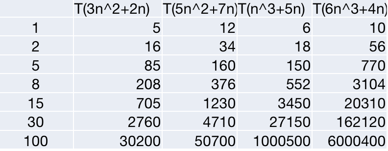

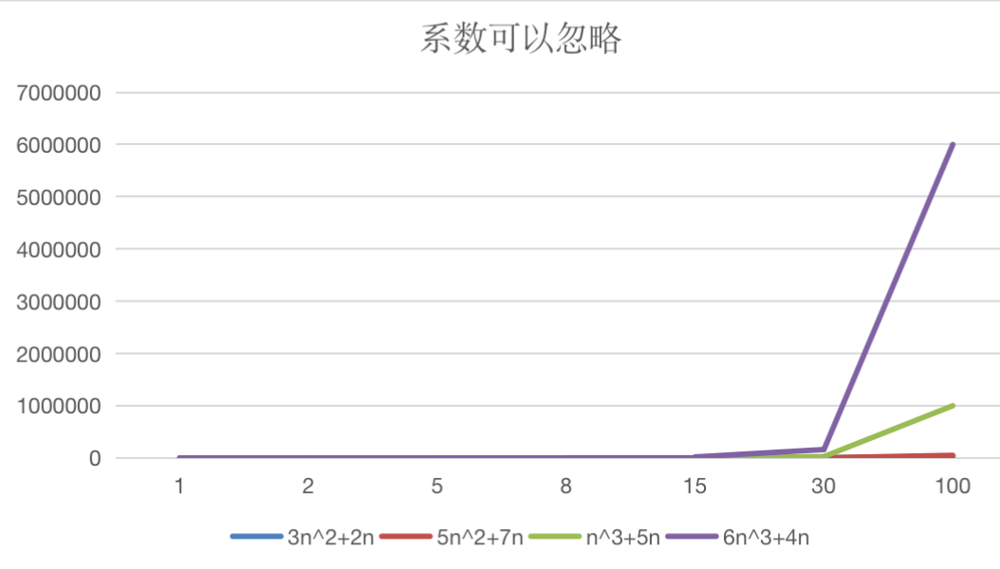

​	结论: 
​	随着n值变大，5n^2+7n 和 3n^2 + 2n ，执行曲线重合, 说明  这种情况下, 5和3可以忽略。
​	而n^3+5n 和 6n^3+4n  ，执行曲线分离，说明多少次方式关键

### 7.3.3 时间复杂度

1. 一般情况下**算法中的基本操作语句的重复执行次数是问题规模n的某个函数**，用T(n)表示，若有某个辅助函数f(n)，使得当 n 趋近于无穷大时，T(n) / f(n) 的极限值为不等于零的常数，则称 f(n)是 T(n)的同数量级函数。记作 **T(n)=**O**( f(n) )**，称O( f(n) ) 为算法的渐进时间复杂度，简称时间复杂度。

2. T(n) 不同，但时间复杂度可能相同。 如:T(n)=n2+7n+6 与 T(n)=3n2+2n+2 它们的 T(n) 不同，但时间复杂 度相同，都为 **O(n**2**)**。
3. 计算时间复杂度的方法:
   1. 用常数 1 代替运行时间中的所有加法常数 T(n)=n2+7n+6 => T(n)=n2+7n+1
   2. 修改后的运行次数函数中，只保留最高阶项 T(n)=n2+7n+1 => T(n) = n2
   3. 去除最高阶项的系数 T(n) = n2 => T(n) = n2 => O(n2)

### 7.3.4 常见的时间复杂度

1. 常数阶O(1)

   

2. 对数阶O(log2n)

   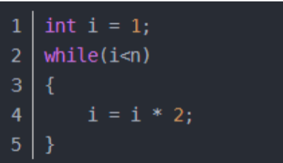

   在while循环里面，每次都将 i 乘以 2，乘完之后，i 距离 n 就越来越近了。假设循环x次之后，i 就大于 2 了，此时这个循环就退出了，也就是说 2 的 x 次方等于 n，那么 x = log2n也就是说当循环 log2n 次以后，这个代码就结束了。因此这个代码的时间复杂度为：O(log2n)  。 O(log2n) 的这个2 时间上是根据代码变化的，i = i * 3 ，则是 O(log3n) .

3. 线性阶O(n)

   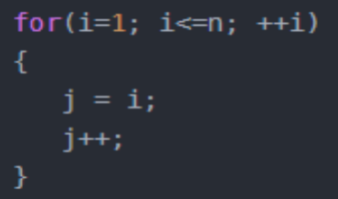

4. 线性对数阶O(nlog2n)

   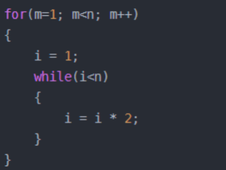

   线性对数阶O(nlogN) 其实非常容易理解，将时间复杂度为O(logn)的代码循环N遍的话，那么它的时间复杂度就是 n * O(logN)，也就是了O(nlogN)

5. 平方阶O(n^2)

   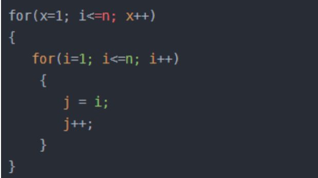

6. 立方阶O(n^3)

7. k 次方阶 O(n^k)

8. 指数阶O(2^n)

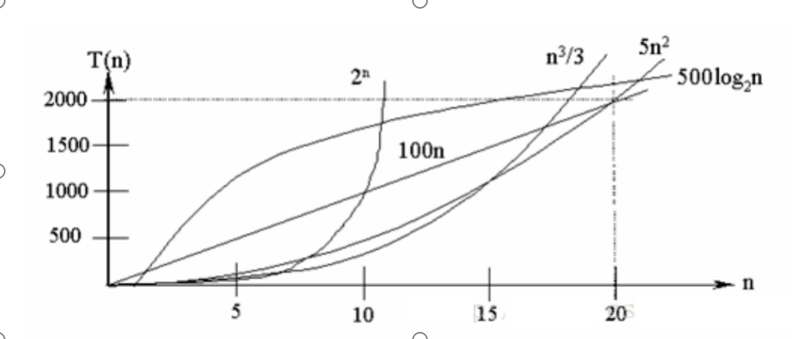

常见的算法时间复杂度由小到大依次为：Ο(1)＜Ο(log2n)＜Ο(n)＜Ο(nlog2n)＜Ο(n2)＜Ο(n3)＜ Ο(nk) ＜Ο(2n) ，随着问题规模n的不断增大，上述时间复杂度不断增大，算法的执行效率越低

### 7.3.5 平均时间复杂度和最坏时间复杂度

1. 平均时间复杂度是指所有可能的输入实例均以等概率出现的情况下，该算法的运行时间。
2. 最坏情况下的时间复杂度称最坏时间复杂度。一般讨论的时间复杂度均是最坏情况下的时间复杂度。这样做的原因是:最坏情况下的时间复杂度是算法在任何输入实例上运行时间的界限，这就保证了算法的运行时间不会比最坏情况更长。
3. 平均时间复杂度和最坏时间复杂度是否一致，和算法有关

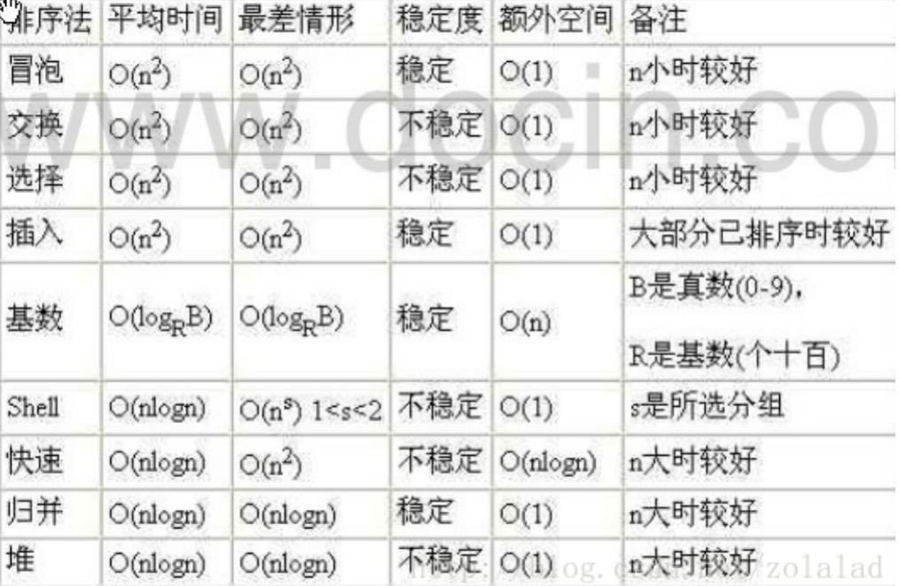

## 7.4 算法的空间复杂度

### 7.4.1 基本介绍

1. 类似于时间复杂度，一个算法的空间复杂度(SpaceComplexity)定义为该算法所耗费的存储空间，它也是问题规模 n 的函数。
2. 空间复杂度(SpaceComplexity)是对一个算法在运行过程中临时占用存储空间大小的量度。有的算法需要占用的 临时工作单元数与解决问题的规模 n 有关，它随着 n 的增大而增大，当 n 较大时，将占用较多的存储单元，例 如快速排序和归并排序算法**,** 基数排序就属于这种情况
3. 在做算法分析时，主要讨论的是时间复杂度。从用户使用体验上看，更看重的程序执行的速度。一些缓存产品 (redis, memcache)和算法(基数排序)本质就是用空间换时间.

## 7.5 冒泡排序

### 7.5.1 冒泡排序基本思想

从小到大排序

- 比较相邻的元素。如果第一个比第二个大，就交换他们两个。
- 对每一对相邻元素做同样的工作，从开始第一对到结尾的最后一对。在这一轮结束后，最后的元素应该会是最大的数。
- 针对所有的元素重复以上的步骤，除了最后一个。

对于n个数字，当n-1个位置都确定时，那么这个待排序数组就是排序完整的。由于每一轮排序可以确定一个元素，所以n个数需要n-1轮，每轮确定冒出一个最值

### 7.5.2 冒泡优化

优化：如果在某趟排序寻找过程中，没有发生一次交换，说明当前序列已经顺序了，可以提前结束冒泡排序。

## 7.6 选择排序

### 7.6.1 基本介绍

选择排序也属于内部排序算法，是从待排序的数据中，按指定的规则选出某一元素，再按照规定排序方式交换位置后达到排序的目的。

### 7.6.2 选择排序的思想

从小到大排序

- 第一轮循环从arr[0]-arr[n-1]中选取最小值，与arr[0]比较进行交换
- 第二轮循环从arr[1]-arr[n-1]中选取最小值，与arr[1]比较进行交换
- 第i轮循环从arr[i-1]-arr[n-1]中选取最小值，与arr[i-1]比较进行交换
- 第n-1次循环从arr[n-2]-arr[n-1]中选取最小值，与arr[n-2]比较进行交换

也是每轮循环得到一个最值，所以也是需要n-1次循环

## 7.7 插入排序

### 7.7.1 基本介绍

插入排序属于内部排序算法，对待排序的元素以插入的方式找寻该元素适当位置，以达到排序的目的。

### 7.7.2 插入排序的思想

把n个待排序的元素看成一个有序列表和一个无序列表，开始时有序表只包含一个元素，无序表包含n-1个元素，排序过程从无序表中取出第一个元素，使其与有序列表进行比较，为其找到合适的位置，使之成为新的有序表。

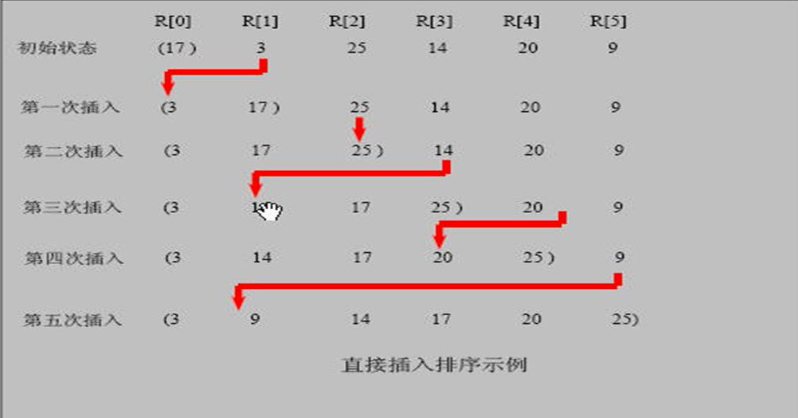

## 7.8 希尔排序

### 7.8.1 插入排序存在的性能问题

当较小的数在待排序数组的后面时，数组移动的次数明显增多，对效率有影响。

如数组arr={2,3,4,5,6,1}，当待插入数是1时，整个过程是这样的。

几乎所有的数组都进行了移动，比较影响性能

## 7.8.2 希尔排序法简介

希尔排序是希尔在1959年提出的一种排序算法，希尔排序也是一种插入排序，它是简单插入排序经过改进之后的一个更高效的版本，也称为缩小增量排序。

### 7.8.3 希尔排序基本思想

希尔排序是把记录按下标的一定增量分组，对每组使用直接插入排序算法排序；随着增量逐渐减少，每组包含的关键词越来越多，当增量减至 1 时，整个文件恰被分成一组，算法便终止。

### 7.8.4 希尔排序法示意图

### 7.8.5 希尔排序实现方式

希尔排序是基于插入排序实现，因此在给待排序元素设置位置时，有**交换**和**移动**两种实现方式。性能上还是有差别的。

## 7.9 快速排序

### 7.9.1 快速排序简介

快速排序是对冒泡排序的一种改进。基本思想是一趟排序将待排序的数据分割成独立的两个部分，其中一部分的所有数据都比另外一部分的所有数据都要小。然后在按此方法对这两部分数据分别进行快速排序，整个排序过程可以递归进行。以此达到整个数据变成有序序列。

### 7.9.2 快速排序基本思想

1. 先从待排序队列中取出一个数作为基准数
2. 分区过程，将比这个数大的放在它的右边，比这个数小的放在它的左边
3. 在对左右区间重复以上步骤，直到各区间只有一个数

### 7.9.3 快速排序过程解析

快速排序的过程可以拆解为：挖坑填数+分治。

以一个数组为例：

取中间一个数作为基数，l为数组起始左边下标，r为数组起始右边下标，emptyIndex为当前坑位的下标，pivot为当前选取的基数变量。

l=0，r=9，emptyIndex=4，pivot=arr[emptyIndex]=60;

由于已经将arr[emptyIndex]的数保存到pivot变量了，可以认为该位置是个空坑，可以让其他数填充了；

此时l=0，从左边开始找大于pivot的数，发现当l=0时，arr[0]=72，大于pivot符合条件，将arr[0]挖出来填充到上一个坑arr[4]的位置上，即arr[4]=arr[0]，让emptyIndex=0；

此时r=9，从右边开始找小于等于pivot的数，发现当r=8时，arr[8]=48，小于pivot符合条件，将arr[8]挖出来填充到上一个坑arr[0]的位置上，即arr[0]=arr[8]，让emptyIndex=8；

此时l=0，从左边开始找大于pivot的数，发现当l=3时，arr[3]=88，大于pivot符合条件，将arr[3]挖出来填充到上一个坑arr[8]的位置上，即arr[8]=arr[3]，将emptyIndex=3；

此时r=8，从右边开始找小于等于pivot的数，发现当r=5时，arr[5]=42，小于pivot符合条件，将arr[5]挖出来填充到上一个坑arr[3]的位置上，即arr[3]=arr[5]，将emptyIndex=5；

此时l=3，从左边开始找大于pivot的数，发现当l=4时，arr[4]=72，大于pivot符合条件，将arr[4]挖出来填充到上一个坑arr[5]的位置上，即arr[5]=arr[4]，将emptyIndex=4；

此时r=5，从右边开始找小于等于pivot的数，发现当r=4时，等于了l，这个时候结束循环。将pivot设置到当前坑的位置上，即arr[emptyIndex]=pivot，最后数组的状态如下所示：可以发现60的左边的数都比60小，60右边的数都比60大。

注意事项：

- 在过程中要创建临时的l和r，不能使用实参left和right值，因为循环过程中会对下标进行移动
- 注意临界值等于的处理，会出现死循环

## 7.10 归并排序

### 7.10.1 归并排序介绍

归并排序是利用归并的思想是实现的排序方法，该算法采用经典的分治策略。分治法将问题分成一些小的问题然后递归求解，而治的阶段则将分的阶段得到的各答案合并在一起，即分而治之。

### 7.10.2 归并排序基本思想

### 7.10.3 归并排序过程解析

将上图中最后一次合并的过程图解如下：

1. i，j分别指向两个子数组的起始位置
2. 比较arr[i]和arr[j]，得到将arr[j]填充到temp数组中，将j++
3. 重复上面的步骤，直到一个子数组末尾结束
4. 将另外的一个数组中剩余的数依次填充到temp数组中
5. 将temp数组中的数拷贝到arr数组中

## 7.11 基数排序

### 7.11.1 基数排序介绍

1. 基于排序属于分配式排序，又称桶子法或bin sort。它是通过键值的各个位的值，将要排序的元素分配至某些桶中，达到排序的作用
2. 基数排序法属于稳定型的排序，基数排序法是效率高的稳定排序法
3. 基数排序法是桶排序的扩展
4. 基数排序是1887年赫尔曼 何乐礼发明的。

### 7.11.2 基数排序基本思想

1. 将所有待排序的数统一为同样的数位长度，数位短的数前面补零，即假如原数组为[10,2,213]，则可以看为[010,002,213]，同时创建一个二维数组的十个桶，每个桶大小是待排序数组的长度即bucket\[10][a r r .length]，然后开始循环;
2. 第一次循环按照数组中待排序的数的个位，将其放到对应的桶中直到数组循环完毕
3. 将桶中的数组按顺序复制到待排序数组中
4. 重复第二、三步
5. 最后将待排序数组就是已经排序的数组

### 7.11.3 基数排序的说明

1. 基数排序是对桶排序的扩展
2. 基数排序是经典的空间换时间的方式，占用内存很大，当对海量数据排序时，容易造成oom。因为要创建十个桶，每个桶大小是待排序数组的长度。即有 4size * 10 * arr.length
3. 基数排序是稳定
4. 这里对有负数的场景没有讨论

